disclaimer:
> this is intended for my team members, and is rather concise
> 
> the code is located [here](https://github.com/teamillusioncmit/frc2026)

git isn't too hard! and its really good for working on code as a team. getting straight into it:

when you make a few changes that you want to save, make a **commit**. it's basically a snapshot of your code at that point, and we can go back to it if necessary. you can also push it to github so that everyone can get the latest commits.

to make a commit, you'll need a message as well. i've been using [conventional commits](https://www.conventionalcommits.org/en/v1.0.0/), which are basically:
```
type: message
```

for example, a real commit from me:
```
feat(drive): deadband joystick inputs
```

---

what if we want to work on different things at the same time though? say i wanted to add an arm subsystem, and you wanted to edit the driving system. we would both make **branches**: essentially alternate timelines. the `main` timeline (branch) would remain intact, while we both can make commits in our own branches.

then, when we're ready (maybe not at the same time!), we can **merge** our branches back into `main`. however, when working at the same time, **conflicts** will definitely arise in which we make changes to the same files. for example:



we need to collapse these into one continuous stream. for that, we can **rebase**, which will merge the commit history in chronological order.

# important vocab

**commit** - a snapshot in time

**branch** - an alternate timeline

**merging** - combining branches

**conflicts** - inconsistencies between branches

**rebasing** - combining the commits from two branches into one continuous stream
