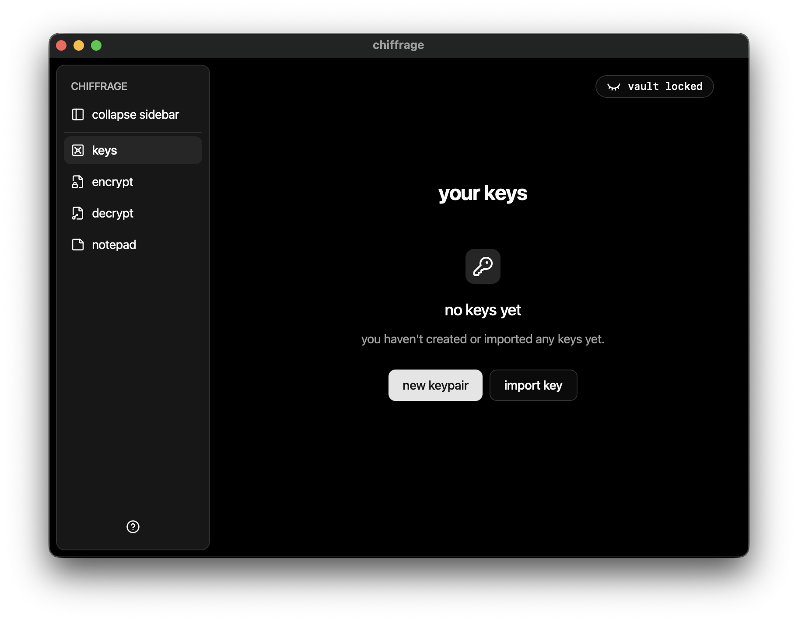
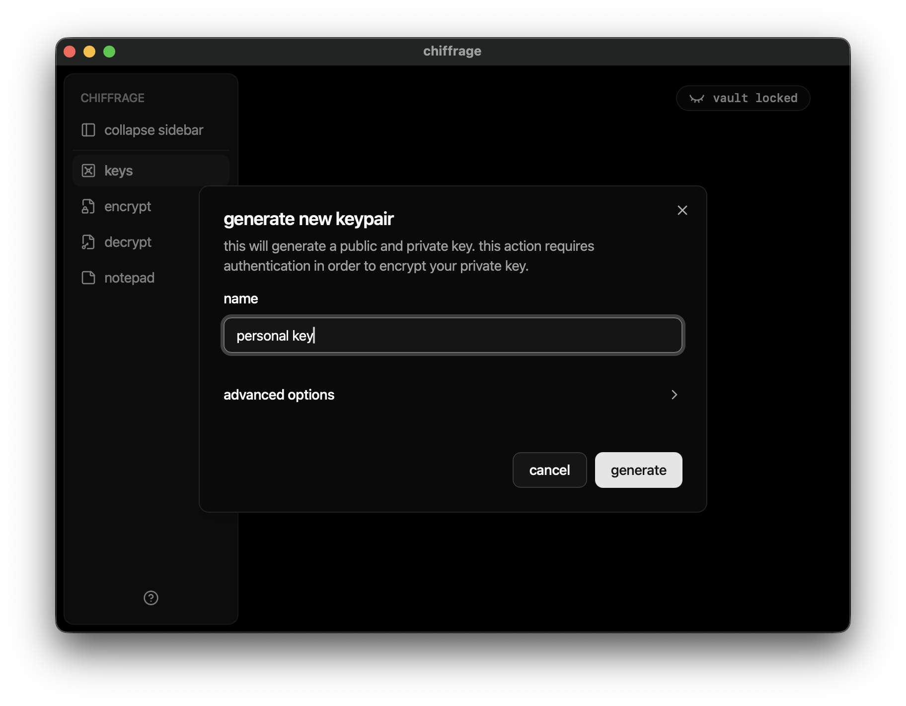
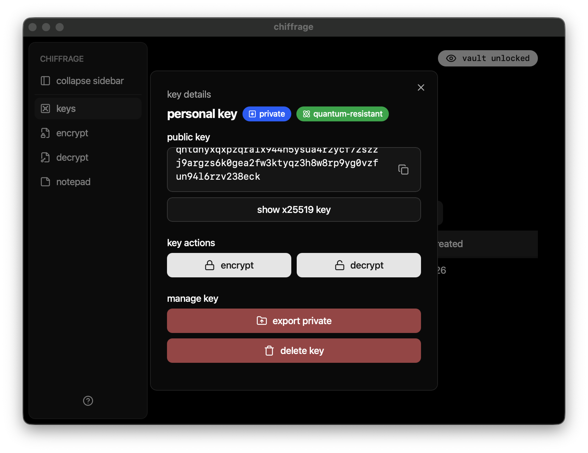

import {Image} from "astro:assets"
import chiffrageIcon from "@assets/imgs/projects/chiffrage/icon.png"

<Image src={chiffrageIcon} alt="chiffrage logo" class="mx-auto w-16 block mt-4" />

chiffrage is a cross-platform GUI for the [age encryption format](https://age-encryption/) that also provides key management features. it relies on the [rage](https://github.com/str4d/rage) crate, which is a rust implementation of the age format.

## getting started

### a short overview of age & asymmetric encryption
age encryption uses [public-key (asymmetric) encryption](https://ssd.eff.org/glossary/public-key-encryption) in which you have a keypair:
- your **public key** is safe to share. files encrypted to your public key will be possible to decrypt with...
- your **private key**, which should NEVER be shared unless you want someone else to decrypt your files.

in short:
- if you want to encrypt files to yourself, just encrypt them to your own key
- if you want to encrypt files to others, you need their public key

### key management
chiffrage allows you to manage keys in one place rather than having to worry about keeping the text safe or organized. you can generate your first keypair by pressing "new keypair" after creating your vault:

all that is required to generate a key is a name, in contrast to PGP's email requirement:

after generating your key, click on it to view its details:

from this dialog, you can share your public key, as well as export your keypair or remove it from the vault altogether.

> did you notice? chiffrage defaults to quantum-resistant MLKEM768-X25519 keys, which unfortunately come at the cost of very long public keys and small but growing usage. using the "convert to x25519" button, you can view it as a standard (quantum-vulnerable) X25519 public key.

you can also import keys from a file or from text using the "import key" button on the keys page.

## security

chiffrage employs a variety of security measures to keep your key data safe.

### rest

keys are stored in a <b>vault file</b> (serialized with CBOR) in which private keys are encrypted using a user provided password. the vault key is derived with argon2id, and stored private keys are encrypted with XChaCha20Poly1305 with a randomized nonce that is stored alongside the private key.

an HMAC is calculated for the vault whenever it is modified, and it is verified whenever the vault is unlocked.

### runtime

furthermore, as keys are encrypted independently, an attacker cannot just get the entire encrypted vault contents out of memory. while fighting against memory attacks is not something that is particularly in scope (or possible), the app still provides some protections, most notably by zeroizing sensitive values (the vault key, private keys) when they're no longer in use, as well as locking them in memory to prevent them from being written to swap on the disk.

### secure defaults

chiffrage will terrorize you quite a bit when trying to make decisions that may sacrifice security. a short list of defaults are:
- defaults to MLKEM768-X25519 keys, which are quantum-safe
- warnings when trying to mix them with standard X25519 keys
- warnings + advice when creating poor passwords
- password generation powered by the [EFF's large wordlist](https://www.eff.org/deeplinks/2016/07/new-wordlists-random-passphrases), which has 7,776 words (for about ~1037 combinations!)

the code and full README are located [here](https://github.com/thrzl/chiffrage).
